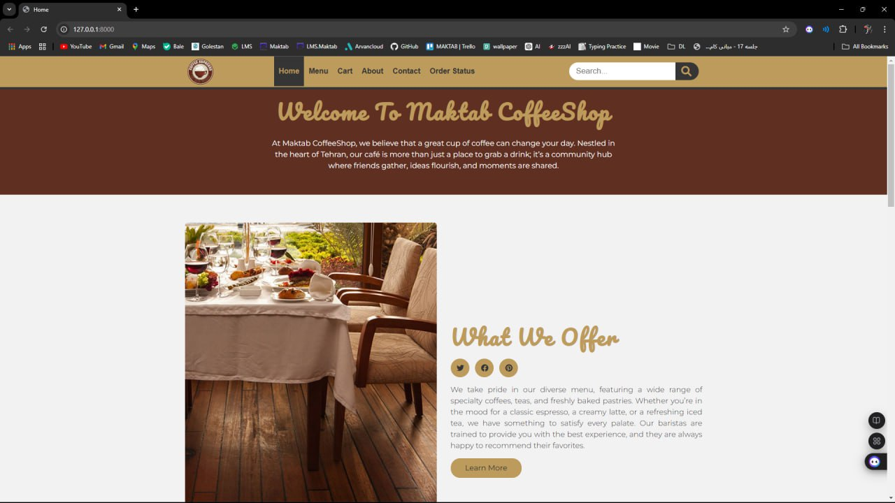

# CafeShopAdventure

**A comprehensive web-based management system tailored for cafes, aimed at optimizing order processing, enhancing inventory management, and providing insightful sales analytics for better decision-making.**
---

## Table of Contents

- [About the Project](#about-the-project)
- [Features](#features)
- [Getting Started](#getting-started)
- [Prerequisites](#prerequisites)
- [Installation](#installation)
- [Usage](#usage)
- [Project Structure](#project-structure)
- [Contributing](#contributing)
- [License](#license)
- [Contact](#contact)

---

## About the Project

**CafeShopAdventure** is a comprehensive web-based management system specifically designed for cafe owners and managers. This project aims to provide an efficient solution to streamline various operations within a cafe, enhancing overall productivity and customer service.

### Key Features:
- **Order Management**: Seamlessly create, edit, and track customer orders, ensuring timely processing and accurate fulfillment.
- **Inventory Tracking**: Real-time monitoring of stock levels, including alerts for low inventory, to facilitate effective product management.
- **Sales Analytics**: Customizable reports that provide insights into sales trends, top-selling items, and performance metrics, enabling informed decision-making.
- **User Role Management**: Support for different user roles (admin, manager, staff), each with specific permissions for secure and organized access.
- **Customer Order History**: Detailed views of customer order histories to better understand purchasing behaviors and enhance service quality.

### Benefits:
- **Centralized Data Management**: Simplifies the complexities of managing multiple systems by centralizing order tracking and reporting, allowing staff to focus on customer service.
- **Improved Decision-Making**: Access to real-time analytics empowers cafe owners to make data-driven decisions, fostering profitability and growth.
- **Enhanced Customer Experience**: Streamlined operations lead to improved service delivery, resulting in higher customer satisfaction and loyalty.

### Target Audience:
This project is tailored for cafe owners, managers, and staff who seek a robust solution for efficiently managing daily operations while ensuring a smooth and enjoyable customer experience.


## Features

- Order management and tracking
- Sales analytics and customizable reports
- Inventory monitoring and management
- User roles (admin, manager, staff) with different permissions
- Customer order history and insights

---

## Getting Started

### Prerequisites

- Python 3.7 or higher
- Git
- Required packages can be installed using:

    ```bash
    pip install asgiref==3.8.1 Django==5.1.2 sqlparse==0.5.1 tzdata==2024.2
    ```

    Alternatively, you can install the dependencies using `requirements.txt`:

    ```bash
    pip install -r requirements.txt
    ```

### Installation

1. Clone the repository:
    ```bash
    git clone https://github.com/AmirTTrimA/CafeShopAdventure.git
    cd CafeShopAdventure
    ```

2. Create a virtual environment:
    ```bash
    python -m venv venv
    source venv/bin/activate  # On Windows: venv\Scripts\activate
    ```

3. Install the dependencies:
    ```bash
    pip install -r requirements.txt
    ```

4. Run migrations to set up the database:
    ```bash
    python manage.py migrate
    ```

5. Create a superuser to access the admin panel:
    ```bash
    python manage.py createsuperuser
    ```

6. Start the server:
    ```bash
    python manage.py runserver
    ```

---

## Usage

1. Logging into the Application
Step 1: Open your web browser and navigate to the application's URL.
Step 2: You will see the login page. Enter the admin username and password that you created earlier.
Step 3: Upon successful login, you will be redirected to the main dashboard of the application.

2. Navigating through Different Sections
Managing Orders:

Go to the "Orders" section to view the list of current orders.
You can create new orders, change the status of existing orders, and view details for each order.
The application provides search and filter functionalities to help manage orders more easily.
Monitoring Inventory:

Navigate to the "Inventory" section to view the list of products and their current stock levels.
You can check product details, including name, price, and available quantity.
There are options to edit or delete products from the inventory, as well as to add new products.

3. Viewing Reports
Reports Section:
Go to the "Reports" section to access analytical data for your project.
Various reports are available:
Top-Selling Items: View which items have generated the most sales.
Sales by Category: Analyze sales data for each product category.
Customer Order History: Review the order history for each customer to analyze purchasing behavior.

4. Account Settings
Managing Your Account:
In the "Account" section, you can edit your personal information and set a new password.
You can also view your recent account activity for security purposes.

5. Logging Out of the Application
After completing your tasks, use the "Logout" option to exit your account and maintain the security of the application.

Important Notes:
If you encounter any issues while logging in or using the application, please refer to the user guide or project documentation for assistance.
Ensure regular backups of your database and data to maintain the application's performance and security.

### Example Screenshots
#### Home Screen

*This image shows the home screen of the application, providing an overview of the dashboard.*

#### Menu Screen

*This image displays the menu of the application, showcasing various options for order and inventory management.*


## Project Structure

An overview of the main project structure:

CafeShopAdventure/
├── .venv/               # Virtual environment for Python dependencies
├── config/              
│   ├── analytics/       # Analytical models and views for reporting
│   ├── cafe/            # Cafe-specific models and business logic
│   ├── config/          # Django project configuration and settings
│   ├── customer/        # Customer-related models, views, and templates
│   ├── menu/            # Menu and inventory-related models and views
│   ├── order/           # Order processing and management
│   ├── staff/           # Staff and manager-related views, reports, and permissions
│   ├── static/          # Static files like JavaScript, CSS, and images
│   ├── templates/       # HTML templates for the project
│   ├── db.sqlite3       # SQLite database file
│   └── manage.py        # Django command-line utility
├── .gitignore           # Git ignore file to exclude unnecessary files
├── erd.sql              # SQL file for Entity Relationship Diagram (ERD)
├── LICENSE              # License file for the project
├── README.md            # Project's README file
└── requirements.txt     # List of dependencies for the project

---

## Contributing

1. Fork the project.
2. Create a new branch for your feature (`git checkout -b feature/NewFeature`).
3. Commit your changes (`git commit -m 'Add some NewFeature'`).
4. Push to the branch (`git push origin feature/NewFeature`).
5. Open a pull request.

---

## License

Distributed under the MIT License. See `LICENSE` for more information.

---

## Contact

Amir TTrimA - [amirtehrani19@gmail.com](mailto:amirtehrani19@gmail.com)

Project Link: [https://github.com/AmirTTrimA/CafeShopAdventure](https://github.com/AmirTTrimA/CafeShopAdventure)
